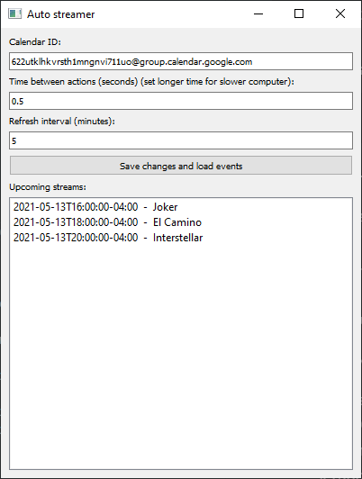
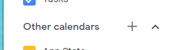
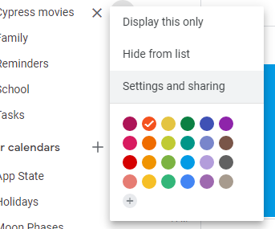
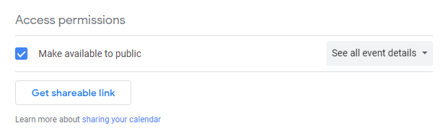
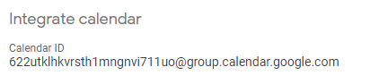
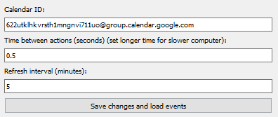

# Auto streamer

Automatically play streaming content based on your Google calendar schedule.



## Requirements
- Python 3.7 or above
- Windows 7 or above
- Functioning Google Chrome installation

## Run for development

Install required packages in virtual environment.
```shell
source env/Scripts/activate
```
```shell
pip install -r requirements.txt
```

Run python app.
```
py main.py
```

## Build for production

Build the executable.
```shell
pyinstaller autostreamer.spec
```

Locate and run `main.exe` in `dist/autostreamer`.

## Configuration

1. Create a new calendar in Google Calendar in the left pane under "Other calendars".
   

   
1. Click on the menu button by your new calendar, and go to "Settings and sharing".
   

   
2. Under the "Access Permissions" section, check the box to make the calendar public.


   
3. Under the "Integrate calendar" section, copy the calendar ID and paste it in the calendar ID field in the app.
   


4. In the next field, enter a time in seconds for the app to wait inbetween each on-screen action. Enter a higher number if your have a slow-running computer.
   
5. Choose a refresh interval in minutes for the app to periodically refresh the calendar data.
   
6. Click "Save changes and load events". The upcoming events on your calendar will be shown below.
   

   
The events will be refeshed every few minutes according to your refresh interval. To refresh manually, click the save changes button again.

## Usage

1. 
   a. Add events to your calendar. In the description field for your event, enter the the stream URL that you want to open when the event starts. Ex:
   
    ```yaml
    url: https://www.youtube.com/watch?v=dQw4w9WgXcQ
    ```
    Be sure to use YAML formatting in the description
    
    b. Give your event a title and start date.

2. Wait for the app to refresh the data or click "Save changes and load events" to see the new events listed.

3. When the event starts, the browser will automatically open and navigate to the url you entered. Do not leave focus on the system UI, such as the windows clock. This will interfere with the window switching mechanism. To be sure, click on the app window before you leave it alone. If it is video content, it will go into fullscreen mode after the page loads.